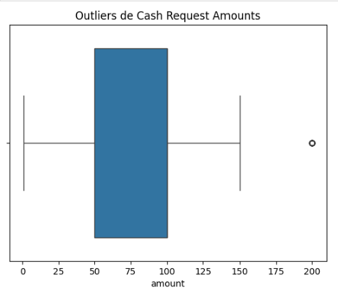
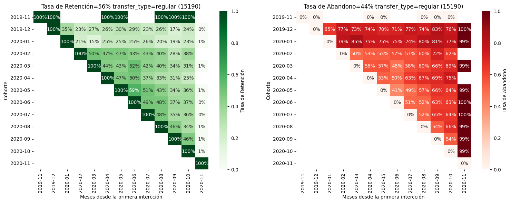

# Desafío Empresarial: Análisis de Insights y Cohortes Avanzados para los Pagos de Business Payments

## Grupo BP

- Germán Zeitz Lalanne
- Jose Niguidula Enriquez

## Modo de Colaboración

- github como repositorio central de código con control de versiones
  - 3 ramas: **main** + 1 rama por participante. 1 carpeta de trabajo por participante.
    - [main](https://github.com/germanztz/data-science-uoc-businessPay/tree/main)
    - [german](https://github.com/germanztz/data-science-uoc-businessPay/tree/german)
    - [jose](https://github.com/germanztz/data-science-uoc-businessPay/tree/jose)

- comunicación por whatsapp y reuniónes diarias por google meet
- estructura repositorio
  - [german](german): carpeta de trabajo
  - [jose](jose): carpeta de trabajo
  - [project_dataset](project_dataset): carpeta archivos del proyecto
  - [businessPay_CR.ipynb](businessPay_CR.ipynb) - codigo de análisis de Cash Request
  - [businessPay_Fees.ipynb](businessPay_Fees.ipynb) - código de análisis de Fees
  - [README.md](README.md) - Presentación ejecutiva

## Entregables del Proyecto

## 1. **Código en Python:**

_Proporcionar un código bien documentado que incluya la carga de datos, preprocesamiento, creación de cohortes, cálculo de insights y generación de visualizaciones. Es fundamental garantizar que los resultados sean correctamente interpretados y explicados de manera clara en el código._

    Repositorio de entregables: <https://github.com/germanztz/data-science-uoc-businessPay.git>

## 2. **Informe del Análisis Exploratorio de Datos:**

_Elaborar un informe detallado en formato markdown que resuma los hallazgos más importantes del EDA. Este informe debe incluir visualizaciones relevantes y conclusiones clave para facilitar la comprensión del conjunto de datos y sus principales características._

### Outliers Cash Requests y Fees

    - Conclusiones: Fees con tarifa plana de 5$, existe filas con 10 en fees. Analisis indica que puedes ser un error.

### Valores request amount y fees

  Existe 1 registro de fee con importe 'amount' a 10$ para un cash request de 50$. Es probablemente un error.
  
## 3. **Informe del Análisis de Calidad de Datos:**

_Documentar en formato markdown los resultados del análisis de calidad de los datos, identificando problemas encontrados (como valores faltantes o inconsistencias) y detallando las soluciones implementadas para garantizar la confiabilidad del análisis posterior._

**Análisis Cash Requests y Fees**

#### Observaciones 
    - deleted_account_id y user_id tienen nulos complementarios, se pueden integrar en una sola columna
    - reco* solo están informadas para aquellos registros afectados, el resto de resistros pueden contener nulos
    - moderated_at está menos poblada a medida que pasa el tiempo, podría implicar una menor confiabilidad
    - money_back y received están más pobladas a medida que pasa el tiempo

#### Observaciones 

    El archivo CSV contiene 13 columnas y 21,061 filas. Aquí hay un resumen de las acciones necesarias para limpiar los datos:

    1. Manejo de valores faltantes
        - Columnas como `category`, `paid_at`, `from_date`, `to_date` contienen valores nulos. Se decidirá si imputar o eliminar dependiendo del análisis requerido.

    2. Estandarización de formatos
        - **Fechas**: Las columnas `created_at`, `updated_at`, `paid_at`, `from_date`, `to_date` deben convertirse a formato datetime.
        - **Nombres de columnas**: Se convertirán a minúsculas y se reemplazarán los espacios con guiones bajos para consistencia.
        - **Tipos de datos**: Verificar y ajustar los tipos de datos según la naturaleza de cada columna.

    3. Filtrado de datos irrelevantes
        - Determinar las filas irrelevantes o fuera del alcance del análisis. Esto dependerá de columnas clave como `type` o `status`.

        Voy a implementar estos pasos ahora.

        La limpieza de datos está completa. Aquí está el resumen del resultado:

        Resumen del Dataset Limpio
        - **Total de filas**: 16,035 (eliminadas filas con valores nulos en `cash_request_id` y filtradas por `status` válido).
        - **Columnas ajustadas**:
        - Valores nulos en `category` imputados con "Unknown".
        - Formato de columnas de fechas (`created_at`, `updated_at`, etc.) convertido a `datetime`.
        - Nombres de columnas estandarizados (minúsculas y con guiones bajos).
        - **Datos faltantes**:
        - `paid_at`: 596 filas con valores nulos.
        - `from_date` y `to_date`: la mayoría de los valores están nulos, lo cual requiere análisis adicional.
    

# Análisis Exploratorio de Datos (EDA)

## 1. Análisis Cash Requests

**Conclusiones**

    Existen Amounts de 200, pero nada indica que sean errores

### 1.1 Distribución de datos categóricos

**Conclusiones**

    - Existen Amounts de 200, pero nada indica que sean errores
    - El producto más consumido es cash request de 100, seguido de 50

### 1.1 Análisis de dispersión bivariable

Gráfico de dispersión de amount vs created_at

Gráfico de dispersión de created_at vs updated_at

Gráfico de dispersión de created_at vs send_at

Gráfico de dispersión de cash_request_received_date vs send_at

**Conclusiones**

  - Hay una clara demanda de CR de 100 y a mediados de 2020 se populariza la de 50
  - Ha habido un update masivo a finales 2020 en dos tandas, una el 11/20 para los creados hasta 06/20 y otra a finales de 12/20 para los creados desde el 06/20 (Gráfico de dispersión de created_at vs updated_at)
  - Hubo un retraso de una semana en el envio de los creados el 20/09/21 (Gráfico de dispersión de created_at vs send_at)

### 1.3 Análisis de descomposición de series temporales

**Conclusiones**

### 1.4 Análisis de Cohortes Avanzado y la Extracción de Insights

#### 1.4.1 Tasa de retención general

Tasa de Retención Global (Todos los Clientes)

Tasa de Retención Cohorte **"Clientes con status = canceled"**

Tasa de Retención Cohorte **"Clientes con status = rejected"**

Tasa de Retención Cohorte **"Clientes con transfer_type = regular"**

Tasa de Retención Cohorte **"Clientes con transfer_type = instant"**

Tasa de Retención Cohorte **"Clientes con recovery_status = completed"**

Tasa de Retención Cohorte **"Clientes más activos"**

Tasas de retención Cohorte **"Clientes que tuvieron algún problema de pago"**

**Conclusiones**

    - La tasa de retención de los clientes que tienen transferencias instantaneas es superior los que tienen regular (user_id en otro registro con transfer_type = instant: 11167)
    - La tasa de retención de clientes que presentan alguna incidencia en el pago es superior a la media
    - Los clientes más activos con alta 04-05/2020 tuvieron baja retención en 08-09/2020'

3. **Ingresos Generados por Cohorte:** Calcular el total de ingresos generados por cada cohorte a lo largo del tiempo para evaluar el impacto financiero del comportamiento de los usuarios.

Dinero total recibido por los clientes por mes con predicción de tendencia

Dinero total recibido por mes con predicción de tendencia del Cohorte **"Top 50 users"**

Dinero total recibido por mes con predicción de tendencia del Cohorte **"usuarios con cash requests canceladas"**

Dinero total recibido por mes con predicción de tendencia del Cohorte **"Usuarios con status = rejected"**

## 2. Análisis fees

  1. Existen varios filas de fees para 1 unico registro de cash request (CR). Son iteraciones sobre varios peticiones de cambio de CR

    - Varios reiteraciones sobre el mismo request_id : "Postpone Cash Request #request_id" rellenando columnas from_date y to_date.

    - representación grafica de 'total_amount' en 'fees' donde 'paid_at' contiene valor. Se ve una subida entre los meses de  octubre a noviembre 2020, posiblemente por una regularización: alto numero de actualizaciones 'updated_at' en fees en octubre.

  Insights Accionables

    - crear un agrupamiento de 'reasons' truncado a 22 posiciones e identificar lo cash_request_id que han dado mayor numero de interacciones antes de llegar a cobrar los fees

    - Estudiar el comportamiento de los cash_request_id con muchas iteraciones sobre fees sin llegar a cobrar (paid_at)

    - Identificar los usuarios que requieren varios iteraciones antes de pagar los fees (y tambien a recibir el cash request)

  2. Status de cash request sin correspondiente entrada e fees

  Insights Accionables

    - identificar usuarios que tienen más incidencias de rechazo en la petición de cash requests
    
## 4. **Modelos de Regresión Personalizados:**

_Diseñar y optimizar modelos de regresión mediante la búsqueda sistemática de hiperparámetros. Se debe incluir un análisis de residuos y gráficos de dispersión que comparen los valores reales con las predicciones. Justificar las decisiones tomadas en la configuración de los hiperparámetros con base en analisis coherentes de los datos._

    - regresón en el compartamiento de fees basado en 'paid_at' y 'total_amount' 

    - clasificación de usuarios basada en los parametros:
    user_stats['ranking_score'] = (
    0.5 * user_stats['total_fees_paid'] +
    0.3 * user_stats['total_cash_request_amount'] +
    0.2 * user_stats['transaction_count']

### Métricas Iniciales para el Proyecto

Las métricas iniciales a calcular y analizar para comenzar el proyecto son las siguientes:

1. **Frecuencia de Uso del Servicio:** Analizar con qué frecuencia los usuarios de cada cohorte utilizan los servicios de adelanto de efectivo de Business Payments a lo largo del tiempo.
2. **Tasa de Incidentes:** Determinar la tasa de incidentes, especialmente aquellos relacionados con problemas de pago, en cada cohorte. Identificar variaciones significativas entre cohortes.
3. **Ingresos Generados por Cohorte:** Calcular el total de ingresos generados por cada cohorte a lo largo del tiempo para evaluar el impacto financiero del comportamiento de los usuarios.
4. **Métricas Acumuladas por Cohorte:** Proponer y calcular métricas acumuladas que proporcionen perspectivas adicionales para la extracción de insights accionables.

Antes de proceder al análisis de Business Payments, se realizará un análisis exploratorio de datos (EDA) para obtener una comprensión profunda del conjunto de datos. Este análisis incluirá estadísticas clave, distribuciones y visualizaciones para identificar patrones y valores atípicos. El EDA ayudará a tomar decisiones informadas sobre estrategias de preprocesamiento y análisis de datos.

