# Desafío Empresarial: Análisis de Insights y Cohortes Avanzados para los Pagos de Business Payments

## Grupo

participantes

- Germán Zeitz Lalanne
- Jose Niguidula Enriquez

## Modo de Colaboración

- github como repositorio central de código con control de versiones
  - 3 ramas: **main** + 1 rama por participante. 1 carpeta de trabajo por participante.
    - main
    - german
    - jose

- comunicación por whatsapp y reuniónes diarias por google meet
- estructura repositorio
  - german: carpeta de trabajo
  - jose: carpeta de trabajo
  - project_dataset: carpeta archivos del proyecto
  - common.py - código común de carga, limpieza de datos
  - AED.ipynb - codigo de análisis exploratorio de datos
  - ACD.ipynb - código de análisis de calidad de datos
  - MRP.ipynb - código de modelos regresión personalizados de datos
  - README.md - Presentación ejecutiva

## Entregables del Proyecto

## 1. **Código en Python:**

_Proporcionar un código bien documentado que incluya la carga de datos, preprocesamiento, creación de cohortes, cálculo de insights y generación de visualizaciones. Es fundamental garantizar que los resultados sean correctamente interpretados y explicados de manera clara en el código._

    Repositorio de entregables: <https://github.com/germanztz/data-science-uoc-businessPay.git>

        - common.

## 2. **Informe del Análisis Exploratorio de Datos:**

_Elaborar un informe detallado en formato markdown que resuma los hallazgos más importantes del EDA. Este informe debe incluir visualizaciones relevantes y conclusiones clave para facilitar la comprensión del conjunto de datos y sus principales características._

### Outliers Cash Requests y Fees

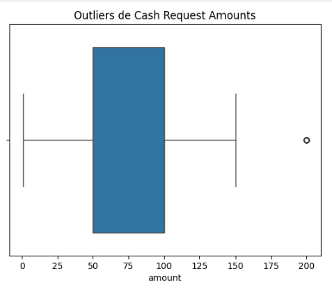

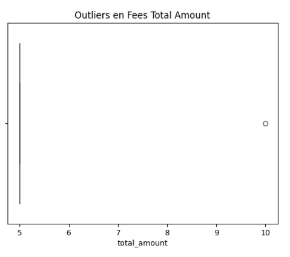

    - _Conclusiones: Existen Amounts de 200 en fees, pero nada indica que sean errores_

### Valores request amount y fees

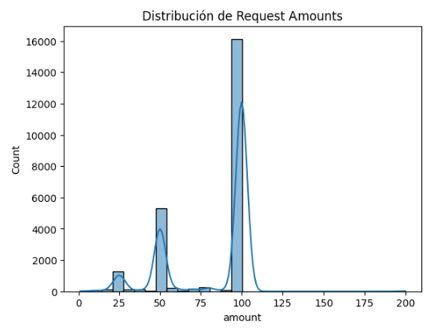

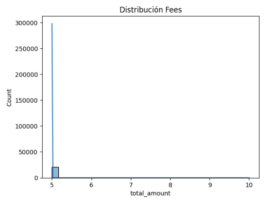

  Existe 1 registro de fee con importe 'amount' a 10$ para un cash request de 50$. Es probablemente un error.
  ¿porque count de 30000?

## 3. **Informe del Análisis de Calidad de Datos:**

_Documentar en formato markdown los resultados del análisis de calidad de los datos, identificando problemas encontrados (como valores faltantes o inconsistencias) y detallando las soluciones implementadas para garantizar la confiabilidad del análisis posterior._

**Análisis Cash Requests y Fees**

 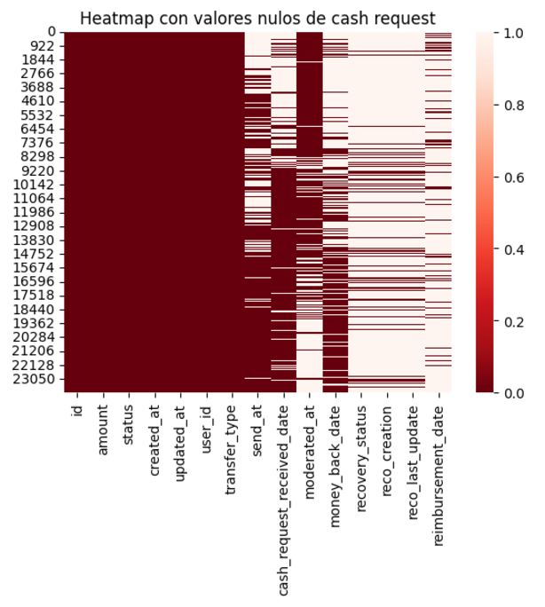

    - _Conclusiones: deleted_account_id y user_id tienen nulos complementarios_

    - _Conclusiones: reco* solo están informadas para aquellos registros afectados_

    - _Conclusiones: moderated_at está menos poblada a medida que pasa el tiempo_

    - _Conclusiones: money_back y received están más pobladas a medida que pasa el tiempo_

 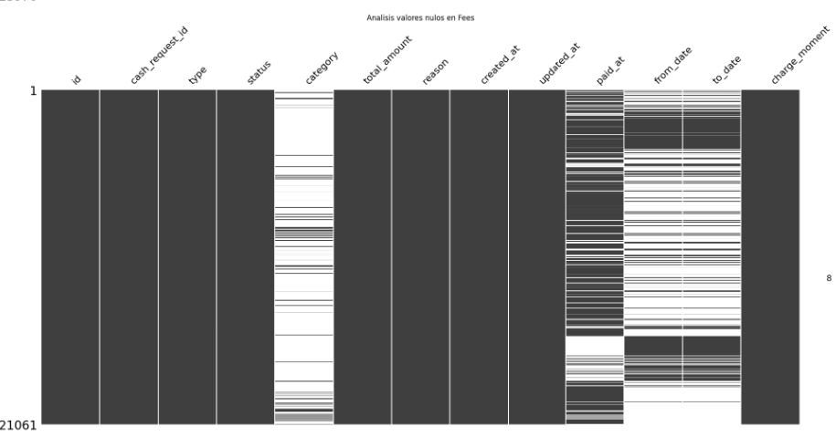

    El archivo CSV contiene 13 columnas y 21,061 filas. Aquí hay un resumen de las acciones necesarias para limpiar los datos:

    1. Manejo de valores faltantes
        - Columnas como `category`, `paid_at`, `from_date`, `to_date` contienen valores nulos. Se decidirá si imputar o eliminar dependiendo del análisis requerido.

    2. Estandarización de formatos
        - **Fechas**: Las columnas `created_at`, `updated_at`, `paid_at`, `from_date`, `to_date` deben convertirse a formato datetime.
        - **Nombres de columnas**: Se convertirán a minúsculas y se reemplazarán los espacios con guiones bajos para consistencia.
        - **Tipos de datos**: Verificar y ajustar los tipos de datos según la naturaleza de cada columna.

    3. Filtrado de datos irrelevantes
        - Determinar las filas irrelevantes o fuera del alcance del análisis. Esto dependerá de columnas clave como `type` o `status`.

        Voy a implementar estos pasos ahora.

        La limpieza de datos está completa. Aquí está el resumen del resultado:

        Resumen del Dataset Limpio
        - **Total de filas**: 16,035 (eliminadas filas con valores nulos en `cash_request_id` y filtradas por `status` válido).
        - **Columnas ajustadas**:
        - Valores nulos en `category` imputados con "Unknown".
        - Formato de columnas de fechas (`created_at`, `updated_at`, etc.) convertido a `datetime`.
        - Nombres de columnas estandarizados (minúsculas y con guiones bajos).
        - **Datos faltantes**:
        - `paid_at`: 596 filas con valores nulos.
        - `from_date` y `to_date`: la mayoría de los valores están nulos, lo cual requiere análisis adicional.
    

## Análisis fees

  1. Existen varios filas de fees para 1 unico registro de cash request (CR). Son iteraciones sobre varios peticiones de cambio de CR

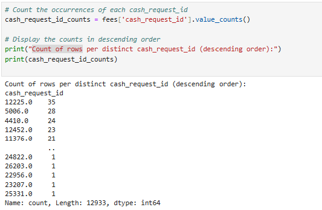

    - Varios reiteraciones sobre el mismo request_id : "Postpone Cash Request #request_id" rellenando columnas from_date y to_date.

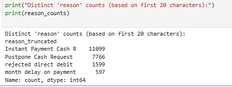

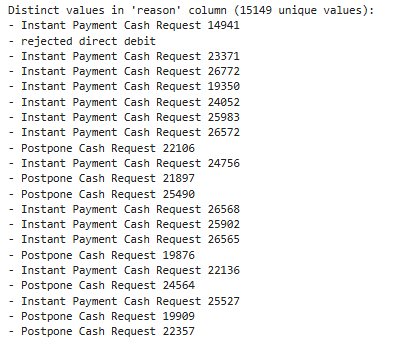

  Insights Accionables

    - crear un agrupamiento de 'reasons' truncado a 22 posiciones e identificar lo cash_request_id que han dado mayor numero de interacciones antes de llegar a cobrar los fees

    - Estudiar el comportamiento de los cash_request_id con muchas iteraciones sobre fees sin llegar a cobrar (paid_at)

    - Identificar los usuarios que requieren varios iteraciones antes de pagar los fees (y tambien a recibir el cahs request)

  2. Status de cash request sin correspondiente entrada e fees

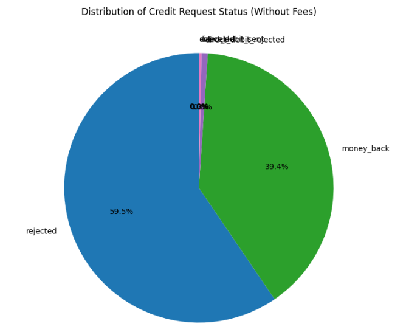

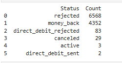

  Insights Accionables

    - identificar usuarios que tienen más incidencias de rechazo en la petición de cash requests
     

## 4. **Modelos de Regresión Personalizados:**

_Diseñar y optimizar modelos de regresión mediante la búsqueda sistemática de hiperparámetros. Se debe incluir un análisis de residuos y gráficos de dispersión que comparen los valores reales con las predicciones. Justificar las decisiones tomadas en la configuración de los hiperparámetros con base en analisis coherentes de los datos._

    - regresón en el compartamiento de fees basado en usuario, cohorte de 'reasons', trimestre/epoca del año 

## 5. **Presentación Ejecutiva y Repositorio de GitHub:**

_Crear un informe resumido en formato markdown que resuma los hallazgos clave del análisis exploratorio y de calidad de datos, así como los insights obtenidos. Este informe debe estar diseñado para los stakeholders de Business Payments y presentarse con claridad y precisión técnica. Además, este documento será el archivo README del repositorio del proyecto, sirviendo como guía principal para quienes revisen el trabajo realizado.
